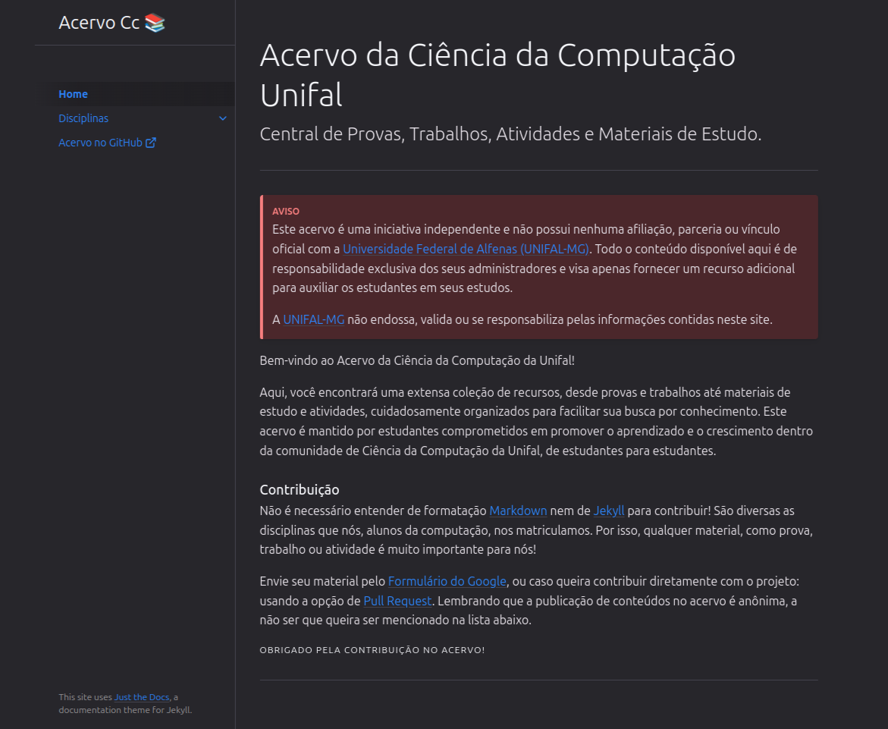

<p align="center">
    <h1 align="center">Unifal-MG | Acervo Ciência da Computação</h1>
    <p align="center">Central de Provas, Trabalhos, Atividades e Materiais de Estudo</p>
    <p align="center" style="margin-top: -10px"><strong><a href="https://LucasWithBoots.github.io/unifal-cc-acervo/">Acesse aqui!</a></strong></p>
    </br>
</p>



<!-- Ainda em construção -->

<!-- ## Contribua

### Novas seções

Todo conteúdo[^1] deve ser alocado dentro da pasta `./docs`.
[^1]: Entende-se por "conteúdo" todo arquivo que contem informações sobre as disciplinas do curso, como avaliações, projetos, artigos e entre outros.

As disciplinas devem ser dividas por subpastas dentro de `./docs`.

### Normalização de conteúdo

Caracteres especiais[^2] e espaços em nomes de conteúdos devem ser substituídos por, respectivamente, seu equivalente em caractere padrão e `-`

[^2]: símbolos gráficos, matemáticos, sinais de pontuação, com exceção do `-`, acentuação

Exemplo de normalização

```
./docs
    /algebra-linar
        prova1.pdf
        prova2.pdf
        trabalho.zip
        index.md
        
```
Note que `./docs/algebra-linear/index.md` é a primeira página que será exibida. Até o momento não é necessário criar outras páginas dentro de cada disciplina além da `./index.md` -->

## Aviso
Este acervo é uma iniciativa independente e não possui nenhuma afiliação, parceria ou vínculo oficial com a [Universidade Federal de Alfenas (UNIFAL-MG)]. Todo o conteúdo disponível aqui é de responsabilidade exclusiva dos seus administradores e visa apenas fornecer um recurso adicional para auxiliar os estudantes em seus estudos.

A [UNIFAL-MG] não endossa, valida ou se responsabiliza pelas informações contidas neste site.

[Confira aqui!]: https://LucasWithBoots.github.io/unifal-cc-acervo/
[UNIFAL-MG]: https://www.unifal-mg.edu.br/portal/index/
[Universidade Federal de Alfenas (UNIFAL-MG)]: https://www.unifal-mg.edu.br/portal/index/
[Unifal]: https://www.unifal-mg.edu.br/portal/index/
[MIT License]: https://github.com/LucasWithBoots/unifal-cc-acervo/blob/main/LICENSE
[Licença MIT]: https://github.com/LucasWithBoots/unifal-cc-acervo/blob/main/LICENSE


