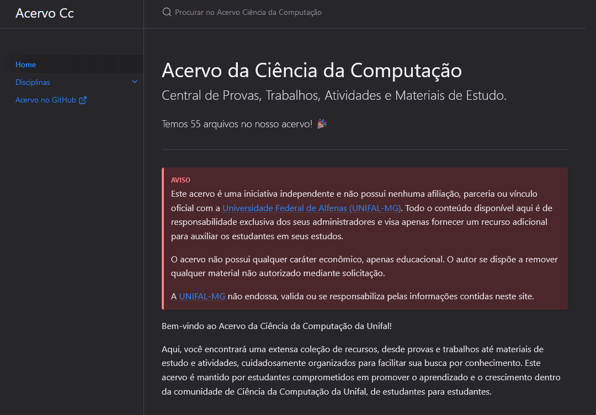

<p align="center">
    <h1 align="center">Unifal-MG | Acervo Ciência da Computação</h1>
    <p align="center">Central de Provas, Trabalhos, Atividades e Materiais de Estudo</p>
    <p align="center">
        
    </p>
    <p align="center" style="margin-top: -10px"><strong><a href="https://LucasWithBoots.github.io/unifal-cc-acervo/">Acesse aqui!</a></strong></p>
    <a href="https://LucasWithBoots.github.io/unifal-cc-acervo/" target="_blank"></a>
    </br>
</p>

## Quais tecnologias o acervo utiliza?

Este acervo foi desenvolvido utilizando [Jekyll], um gerador de sites estáticos que facilita a criação de páginas web rápidas. [Jekyll] é escrito em Ruby e permite transformar arquivos markdown e HTML em um site estático completo. Para o layout e navegação, usamos o template [Just the Docs].

Além da vantagem de criar páginas rapidamente, [GitHub Pages] suporta o uso de [Jekyll], o que torna a publicação de projetos armazenados no GitHub fácil e gratuita.

## Padrão para novos documentos

```
docs/
└── disciplinas/
    └── calculo-1/
        ├── index.md
        └── 2023/
            └── 2/
                └── prova1.pdf

```

- `docs`: Armazena qualquer documento que é disponibilizado
- `disciplinas`: Pasta com todas as disciplinas
- `calculo-1`: Nome da disciplina
- `index.md`: A primeira página (e única, até o momento) que será exibida ao abrir a disciplina
- `2023`: Ano que o documento foi emitido
- `2`: Perído que o documento foi emitido (pode ser "1" ou "2")
- `prova1.pdf`: Exemplo de documento

## Aviso

Este acervo é uma iniciativa independente e não possui nenhuma afiliação, parceria ou vínculo oficial com a [Universidade Federal de Alfenas (UNIFAL-MG)]. Todo o conteúdo disponível aqui é de responsabilidade exclusiva dos seus administradores e visa apenas fornecer um recurso adicional para auxiliar os estudantes em seus estudos.

O acervo não possui qualquer caráter econômico, apenas educacional. O autor se dispõe a remover qualquer material não autorizado mediante solicitação.

A [UNIFAL-MG] não endossa, valida ou se responsabiliza pelas informações contidas neste site.

[Confira aqui!]: https://LucasWithBoots.github.io/unifal-cc-acervo/
[UNIFAL-MG]: https://www.unifal-mg.edu.br/portal/index/
[Universidade Federal de Alfenas (UNIFAL-MG)]: https://www.unifal-mg.edu.br/portal/index/
[Unifal]: https://www.unifal-mg.edu.br/portal/index/
[MIT License]: https://github.com/LucasWithBoots/unifal-cc-acervo/blob/main/LICENSE
[Licença MIT]: https://github.com/LucasWithBoots/unifal-cc-acervo/blob/main/LICENSE
[Jekyll]: https://jekyllrb.com/
[Just the Docs]: https://just-the-docs.github.io/just-the-docs/
[Github Pages]: https://pages.github.com/
